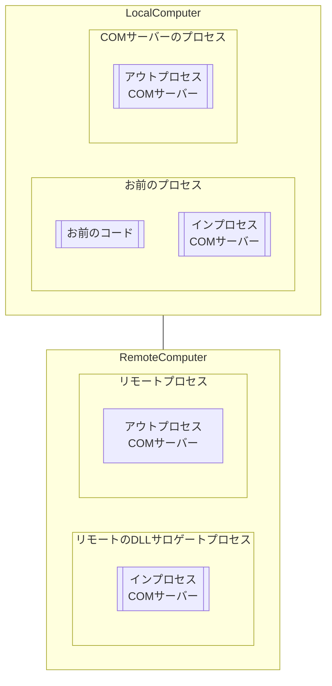

#

```mermaid
graph TD
subgraph LocalComputer
  subgraph お前のプロセス
    host_process[["お前のコード"]]
    in_process[["インプロセス<br/>COMサーバー"]]
  end
  subgraph COMサーバーのプロセス
    out_process[["アウトプロセス<br/>COMサーバー"]]
  end
end
subgraph RemoteComputer
  subgraph リモートのDLLサロゲートプロセス
    remote_in_process[["インプロセス<br/>COMサーバー"]]
  end
  subgraph リモートプロセス
    remote_out_process["アウトプロセス<br/>COMサーバー"]
  end
end
LocalComputer---RemoteComputer
```
