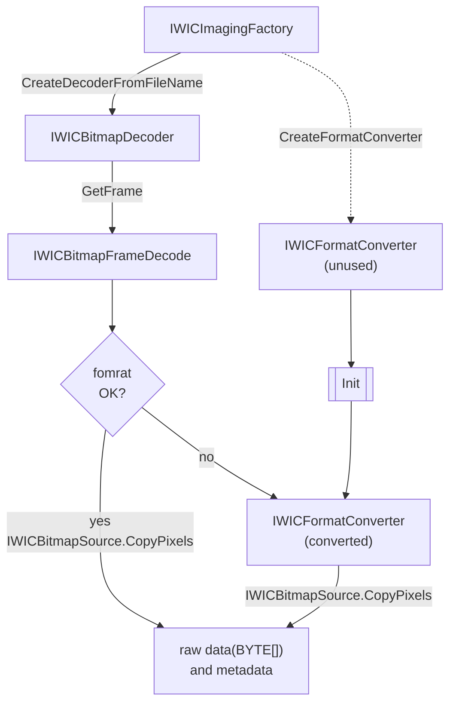
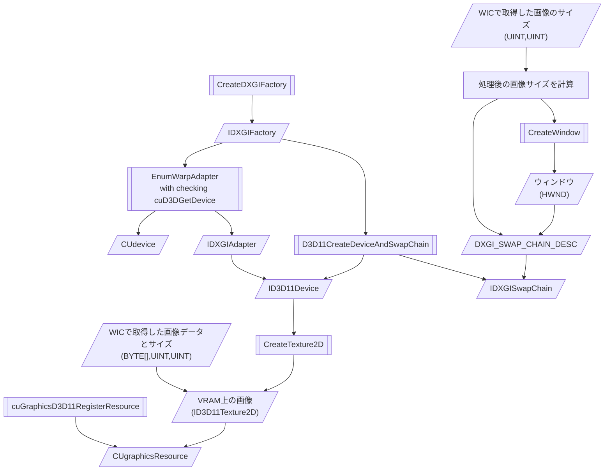

# ReportGPGPU

このページは書きかけです
半分は間違いが入ってます

## やること

このリポジトリ自体は教科書の体ににするつもり

+ GPGPUに関する説明（超簡単に）
+ 開発システムの導入の説明
+ GPUデバイスコードプログラミングについて
+ インターレース画像の生成の実装 !最優先
  + 画像をロード・転送
  WICで画像を転送
  + デバイスコードで処理
  CUDA D3D11 Interpolability
  + 表示
  Direct3D? Direct2D?
  + ストレージに出力
  DirectXの何かしら?
  WinUIライブラリ?
  
## フローチャート

### おまじない（初期化）

### WICでの画像の展開

WICはファイルを生データ(BYTE\[\])に展開するまでを担当する。

### 初期化、画像のロード

> Do not mix the use of DXGI 1.0 (IDXGIFactory) and DXGI 1.1 (IDXGIFactory1) in an application.

### DXGIAdapterの選定

