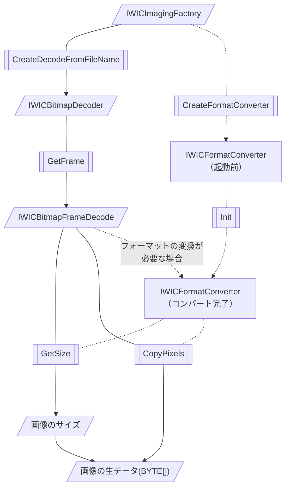
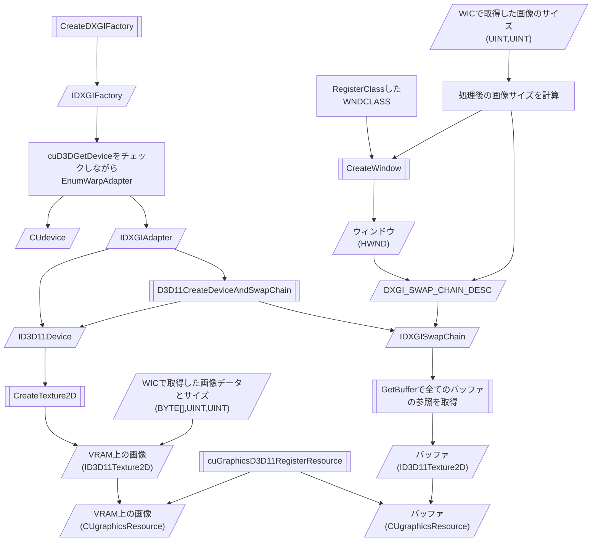
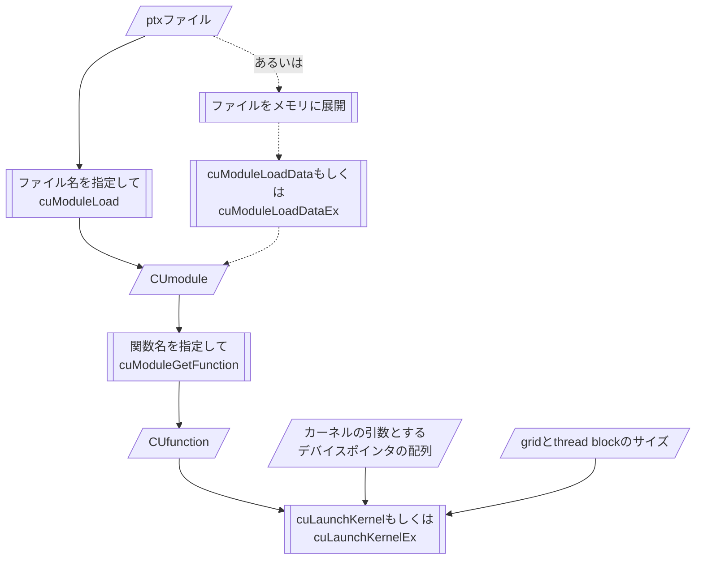
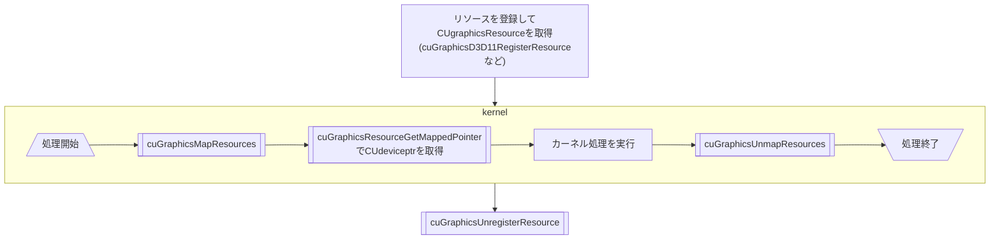
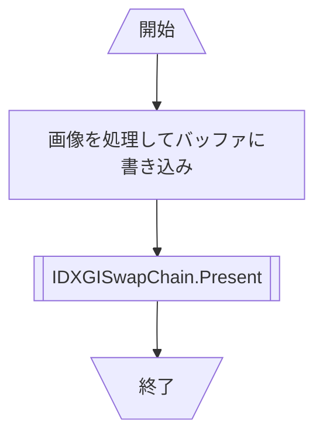

# ReportGPGPU

このページは書きかけです
半分は間違いが入ってます

nvJPEGはTesla用のライブラリらしいので多分使えない
TeslaはHPC専用で映像出せないからあっても無意味

## やること

このリポジトリ自体は教科書の体ににするつもり

+ GPGPUに関する説明（超簡単に）
+ 開発システムの導入の説明
+ GPUデバイスコードプログラミングについて
+ 資料の翻訳
  + 特にNVIDIAの回りくどい説明に手を入れる
+ インターレース画像の生成の実装をデバイス版とホスト版で比較 !最優先
  + 画像をロード・転送
  WIC
  + 画像処理
  デバイス版はカーネルコード、ホスト版はホストコード
  + 表示
  CUDA D3D11 Interoperability
  + ストレージに出力
  WIC
+ 速度の比較
  + その他の形式で、カーネルとホストで速度比較
  + CPUからGPU負荷を分散させるプログラム
+ どんな画像処理をGPUでやったら早いか

## 速度の比較

### ~~nvJPEG vs WICを含めた比較~~

1. デバイスでJPEGの展開を行う
  1.1. nvJPEGでデバイスメモリへ展開
  1.2. CUDAカーネルで画像を処理
  1.3. CUDA Direct3D11 Interoperabilityで画像をDirect3D11預かりに
  1.4. Direct3D11で画面に表示
2. ホストでJPEGの展開を行う
  1.1. WICで展開を行う
  1.2. デバイスで画面を処理
  1.3. Direct3D11でデバイスへ転送
  1.4. Direct3D11で画面に表示

~~NVIDIAが公表しているnvJPEGの性能は多数のJPEGファイルを連続で展開するベンチマークであるため、画面に表示しきれる程度の量の画像では高速化に貢献しづらいのではないか。~~
nvJPEGはTesla用ライブラリなので画面表示について考慮するのはほぼ無意味

## フローチャート

DirectX各インターフェイスのバージョンは適宜読み替え

### おまじない（初期化）

### WICでの画像の展開

WICはファイルを生データ(BYTE\[\])に展開するまでを担当する。 
WICはMPOに非対応まｍｐで、自前で解析してJpegにしてからDecoderに渡す必要がある。そのためのライブラリを用意した。

### 初期化、VRAMへの画像のロード

> Do not mix the use of DXGI 1.0 (IDXGIFactory) and DXGI 1.1 (IDXGIFactory1) in an application.

### CUDA Driver APIでのptxの実行方法

cuModuleLoadExはJITに関する設定を付与できる 
cuLaunchKernelExは矩形情報を構造体で受け取るので同じ設定を使い回す際に有利

### リソースのCUDAでの使用方法

### 表示処理

### メインメモリへのデータの返却、WICでのエンコード

WICは解像度情報も扱える

