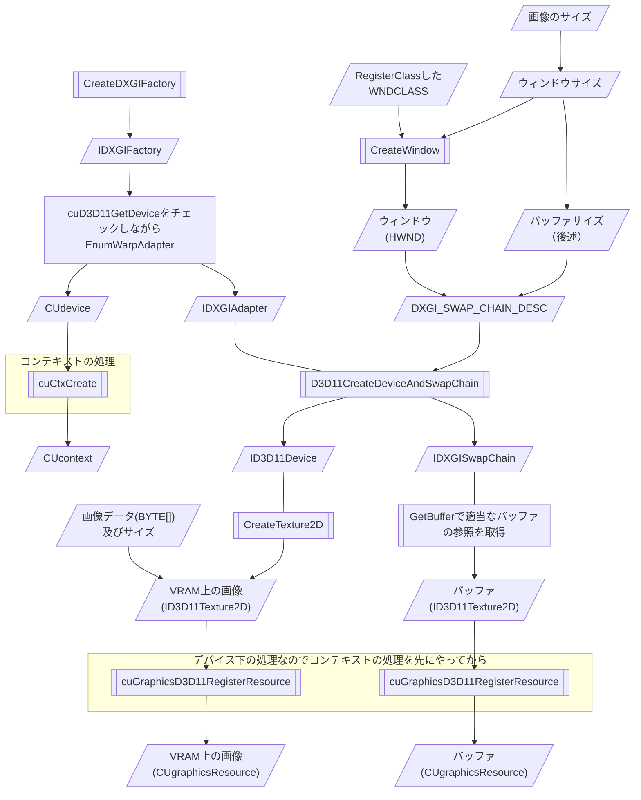
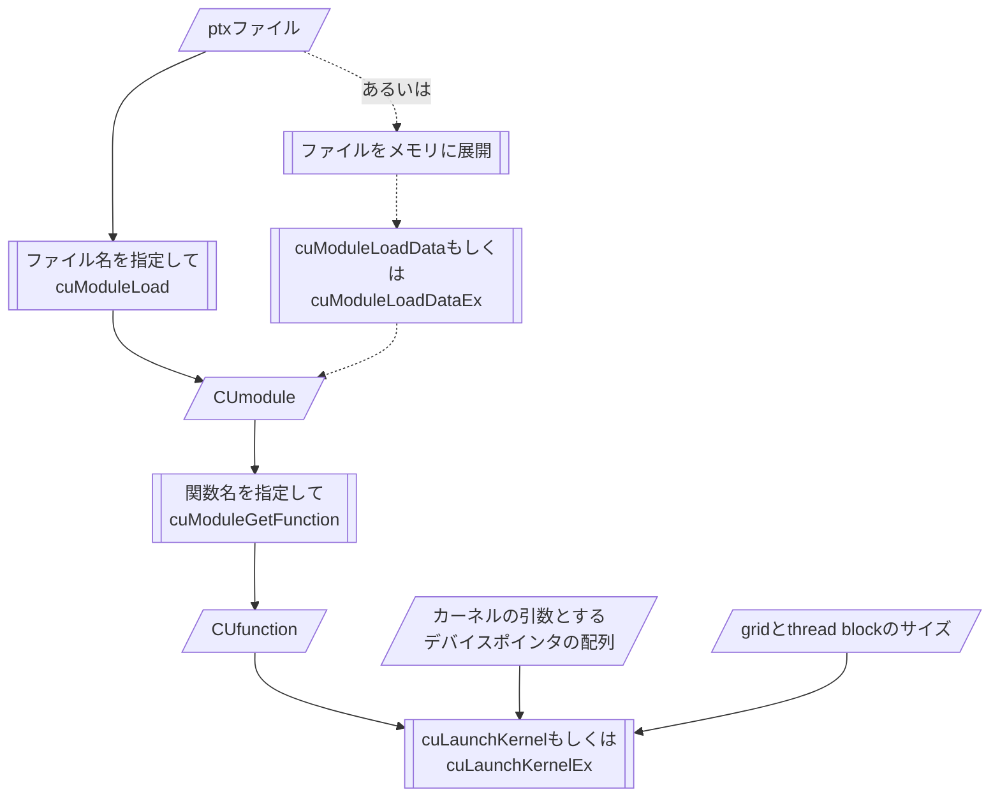
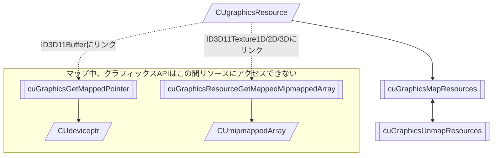

# ReportGPGPU

このページは書きかけです
半分は間違いが入ってます

nvJPEGはTesla用のライブラリらしいので多分使えない
TeslaはHPC専用で映像出せないからあっても無意味

## やること

このリポジトリ自体は教科書の体ににするつもり

+ GPGPUに関する説明（超簡単に）
+ 開発システムの導入の説明
+ GPUデバイスコードプログラミングについて
+ 資料の翻訳
  + 特にNVIDIAの回りくどい説明に手を入れる
+ **動画をGPU内部で再生して、それに手を加えられることを示す**
+ インターレース画像の生成の実装をデバイス版とホスト版で比較
  + 画像をロード・転送
  静止画はWIC、動画はDirectShow
  + ピクセル構造体のフォーマット変換はGPU上の方が早い？
  + 画像処理
  デバイス版はカーネルコード、ホスト版はホストコードorHLSL
  + 表示
  CUDA D3D11 Interoperability
  + ストレージに出力
  WIC
+ 速度の比較
  + その他の形式で、カーネルとホストで速度比較
  + CPUからGPU負荷を分散させるプログラム
+ どんな画像処理をGPUでやったら早いか

## 速度の比較

### ~~nvJPEG vs WICを含めた比較~~

1. デバイスでJPEGの展開を行う
  1.1. nvJPEGでデバイスメモリへ展開
  1.2. CUDAカーネルで画像を処理
  1.3. CUDA Direct3D11 Interoperabilityで画像をDirect3D11預かりに
  1.4. Direct3D11で画面に表示
2. ホストでJPEGの展開を行う
  1.1. WICで展開を行う
  1.2. デバイスで画面を処理
  1.3. Direct3D11でデバイスへ転送
  1.4. Direct3D11で画面に表示

~~NVIDIAが公表しているnvJPEGの性能は多数のJPEGファイルを連続で展開するベンチマークであるため、画面に表示しきれる程度の量の画像では高速化に貢献しづらいのではないか。~~
nvJPEGはTesla用ライブラリなので画面表示について考慮するのはほぼ無意味

## フローチャート

DirectX各インターフェイスのバージョンは適宜読み替え

### おまじない（初期化）


### WICでの画像の展開

WICはファイルを生データ(BYTE\[\])に展開するまでを担当する。<br/>
WICはMPOに非対応である為、自前で解析してJpegにしてからDecoderに渡す必要がある。そのためのライブラリもこのプロジェクトに用意した。

ピクセルフォーマットの変換はGPUで行った方が早い可能性あり。
特に24bitカラーを32bitカラーに変換する場合、変換をGPUで行えば転送すべき画像データが3/4のサイズとなる。

```mermaid
graph TD
  CoCreateInstance[["CoCreateInstance or<br/>CoCreateInstanceEx"]]
  -->IWICImagingFactory[/"IWICImagingFactory"/]
  ---IWICImagingFactory.CreateDecoderFromFileName[["CreateDecodeFromFileName"]]
  -->IWICBitmapDecoder[/"IWICBitmapDecoder"/]
  ---IWICBitmapDecoder.GetFrame[["GetFrame"]]
  -->IWICBitmapFrameDecode[/"IWICBitmapFrameDecode"/]
  --"暗黙キャスト"--->IWICBitmapSource[/"IWICBitmapSource"/]

  IWICBitmapSource
  ---IWICBitmapSource.GetSize[["GetSize"]]
  -->size[/"画像のサイズ"/]
  IWICBitmapSource
  ---IWICBitmapSource.CopyPixels[["CopyPixels"]]
  size & IWICBitmapSource.CopyPixels-->raw[/"画像の生データ(BYTE[])"/]

  IWICImagingFactory
  ----IWICImagingFactory.CreateFormatConverter[["CreateFormatConverter"]]
  -->unusedIWICFormatConverter["IWICFormatConverter<br/>（起動前）"]
  ---IWICFormatConverter.Init[["Init"]]
  -->convertedIWICFormatConverter["IWICFormatConverter<br/>（コンバート完了）"]
  --"暗黙キャスト"-->IWICBitmapSource
  IWICBitmapFrameDecode
  -."ピクセルフォーマット<br/>変換する場合".->IWICFormatConverter.Init

  subgraph WICを用いて<br/>フォーマット変換を行う
    IWICImagingFactory.CreateFormatConverter
    unusedIWICFormatConverter
    IWICFormatConverter.Init
    convertedIWICFormatConverter
  end
```

### 初期化、VRAMへの画像のロード

> Do not mix the use of DXGI 1.0 (IDXGIFactory) and DXGI 1.1 (IDXGIFactory1) in an application.



#### ウィンドウサイズとバッファサイズについて

バッファサイズがレンダーターゲットウィンドウと異なる場合、表示の際に自動でフィットするように変形される。

### CUDA Driver APIでのptxの実行方法

cuModuleLoadExはJITに関する設定を付与できる<br/>
cuLaunchKernelExは矩形情報を構造体で受け取るので同じ設定を使い回す際に有利



### リソースのCUDAでの使用方法

Texture2Dに相当するcuArray間のコピーにはcuMemcpy2Dを使用しなければならない



### 処理内容の反映（画面への表示）

IDXGISwapChain::Presentを呼び出せばよい。
