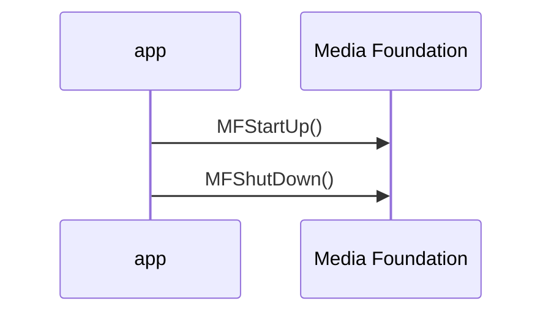
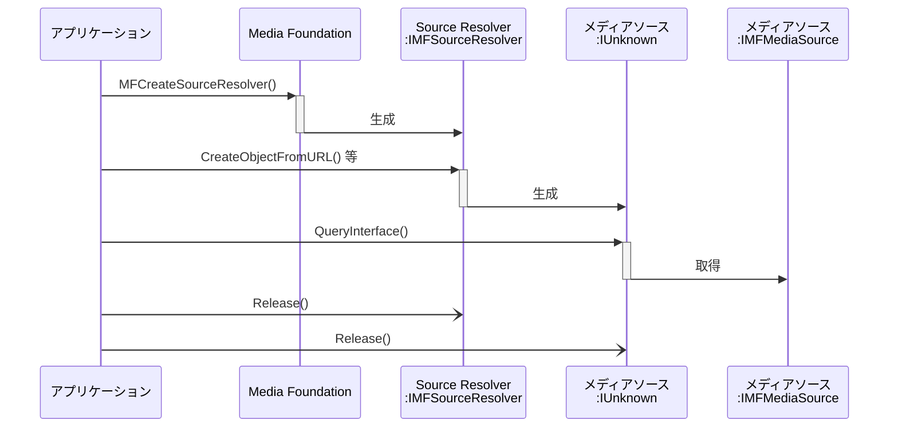
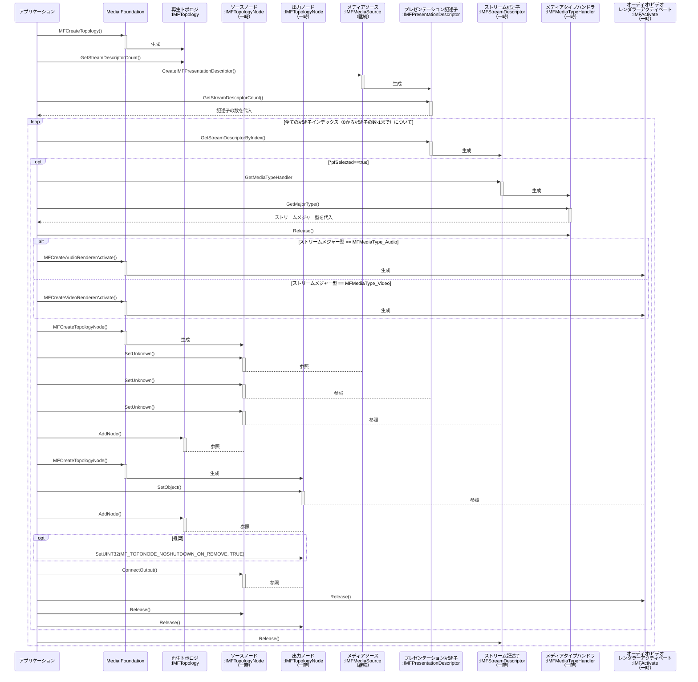

# MediaFoundationの使用に関するダイアグラム

Media Foundationの使用方法についてダイアグラムでまとめてある（途中）

mermaid sequenceDiagramには生成/消失が存在しないのでご容赦
例外処理などは省いている

## Media Foundationの初期化・終了

## ソースリゾルバーの使用

この段はメディアソースを取得することが目的となる。

等、と書いているのは取得方法が4種類あるからである。

## 再生トポロジの作成

この段はトポロジの作成が目的となる。

