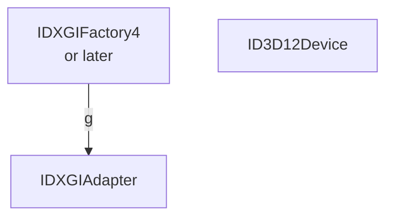

# DIrect3D12について勉強中

## 雑多メモ

D3D12はMTA前提らしい
D3D12にはテクスチャとかが無く、全部ID3D12Resourceなのかもしれない
dllはアプリケーションが持ってる奴とC:/Windows/System32下のもののうちlatestが選択される

## インターフェイスと関係図

## バージョン関係

|Feature Lv.|12.0|12.1|12.2|
|:---------:|:--:|:--:|:--:|
|Windows    |-   |-   |11  |
|DirectX    |12  |    |12U |
|HLSL       |
|Direct3D 12|12.0|
|Direct3D 11|
|Direct2D   |
|DXGI       |

### D3D12インターフェイス

|                   |    |    |    |    |    |    |    |    |    |
|:-----------------:|:--:|:--:|:--:|:--:|:--:|:--:|:--:|:--:|:--:
|**Windows10 ver.** |1703|1709|1803|1809|1903|2004|    |
|**Windows11 ver.** |x   |x   |x   |x   |x   |x   |21H2|
|**AgilitySDK ver.**|x   |x   |x   |x   |x   |x   |1.4 |1.6 |1.7
|
|*HLSL/Shader Model*|6.0 |    |    |6.3 |6.4 |    |6.6 |6.7 |-
|*RayTracing*       |x   |x   |x   |1.0?|    |1.1
|
|Device             |2   |3   |4   |5   |6   |7,8 |9   |    |10
|Fence              |    |1
|GraphicsCommandList|1   |2   |    |    |5   |    |    |    |7
|PipelineLibrary    |1
|Tools              |0
|
|Debug              |2   |    |    |    |    |    |    |    |6

ID3D12GraphicsCommandList6はドキュメントに見つからない
これ書いた時点でAgility SDKは1.6がlatest、1.7はpreview

### DXGIインターフェイス

|DXGI ver.|1.4|1.5|1.6|
|:-------:|:-:|:-:|:-:|
|Factory  | 4 | 5 |6,7|
|Adapter  | 3 | - | 4 |
|Device   | - | 4 | - |
|Output   | 4 | 5 | 6 |
|SwapChain| 3 | 4 | - |
